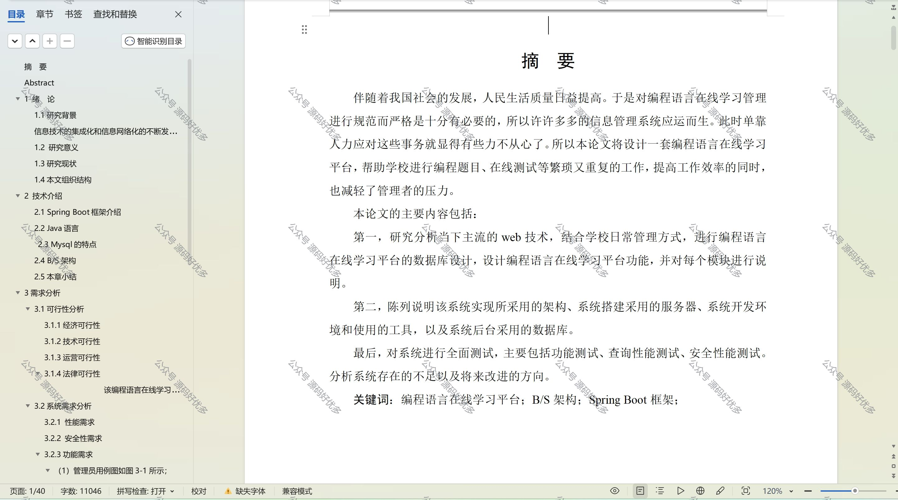

 
## 查看主页获取源码

> **作者介绍**： **✌**全网粉丝10W+本平台特邀作者、博客专家、CSDN新星计划导师、java领域优质创作者,博客之星、掘金/华为云/阿里云/InfoQ等平台优质作者、专注于项目实战 **✌**

  

### 一、作品包含

源码+数据库+设计文档万字+PPT+全套环境和工具资源+部署教程

### 二、项目技术

前端技术：Html、Css、Js、Vue、Element-ui

数据库：MySQL

后端技术：Java、Spring Boot、MyBatis

  

### 三、运行环境

开发工具：IDEA/eclipse

数据库：MySQL5.7

数据库管理工具：Navicat10以上版本

环境配置软件： JDK1.8+Maven3.6.3

前端Nodejs：14

### 四、项目介绍
项目编号：springbootA089

编程语言在线学习平台旨在为用户提供一个便捷、高效的学习环境，帮助用户掌握编程技能，提升逻辑思维和问题解决能力，同时紧跟技术发展趋势，促进个人职业发展和终身学习。

这个平台分为管理员模块和前台用户模块两个部分。

管理员模块包括首页、个人中心、用户管理、视频类型管理、视频课程管理、课程类型管理、文章课程管理、编程题目管理、在线测试管理、系统管理、测试管理等功能。
前台用户模块包括首页、视频课程、文章课程、在线测试、编程资讯和个人中心等功能。

### 五、运行截图

  
